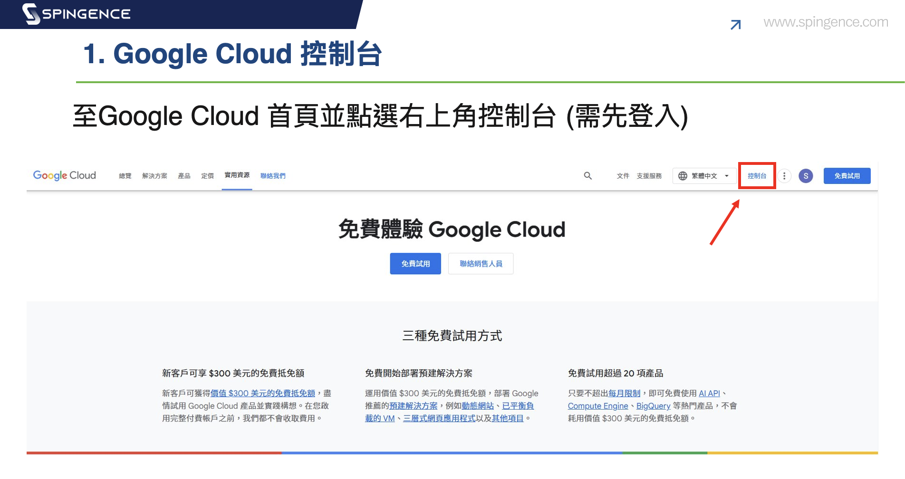
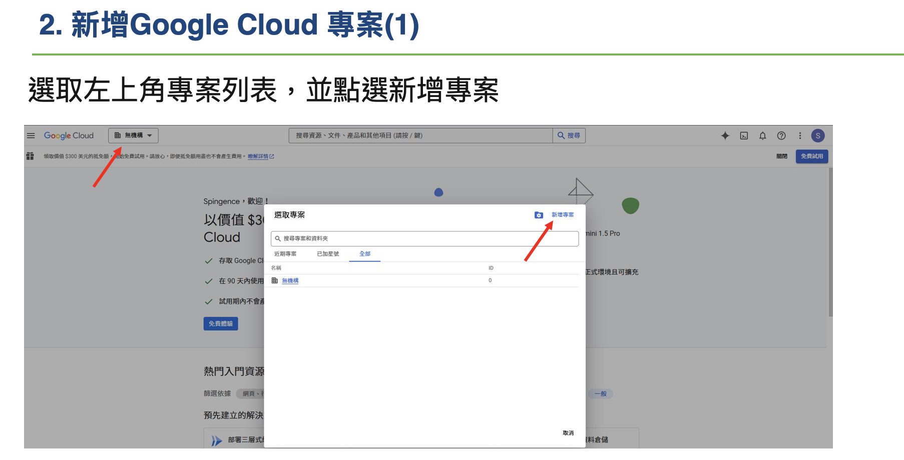
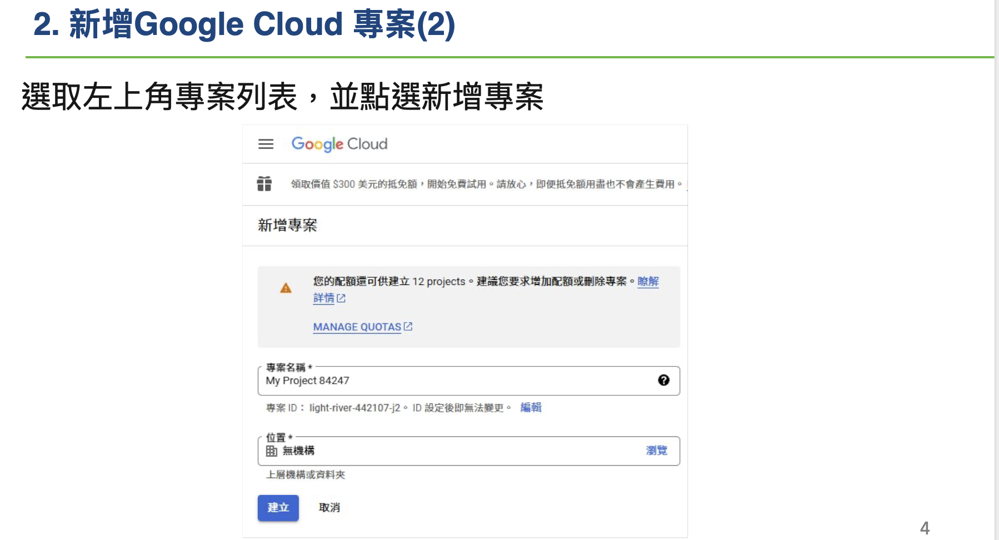
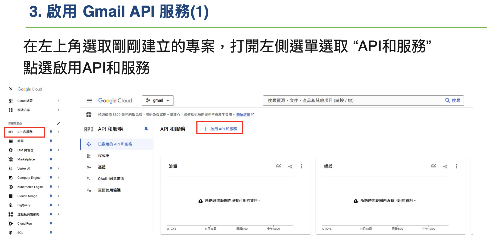
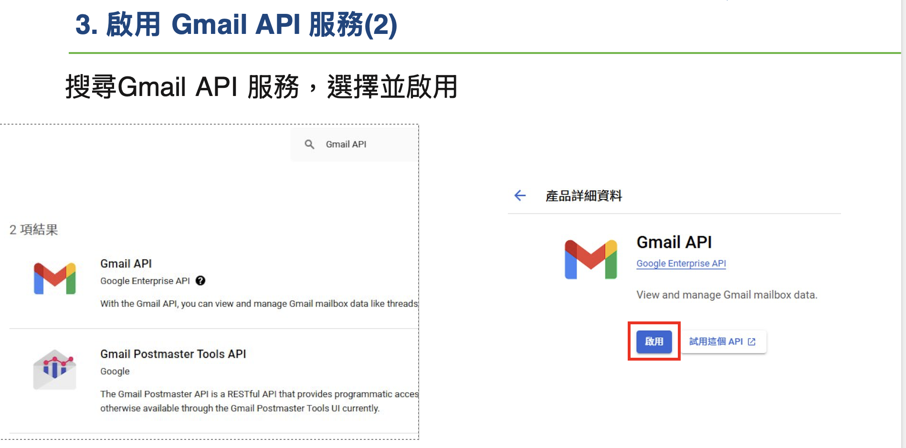
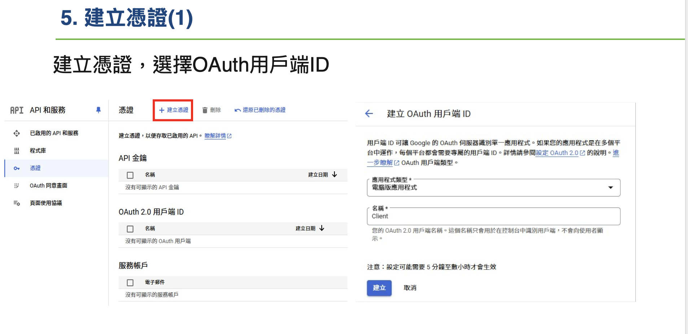
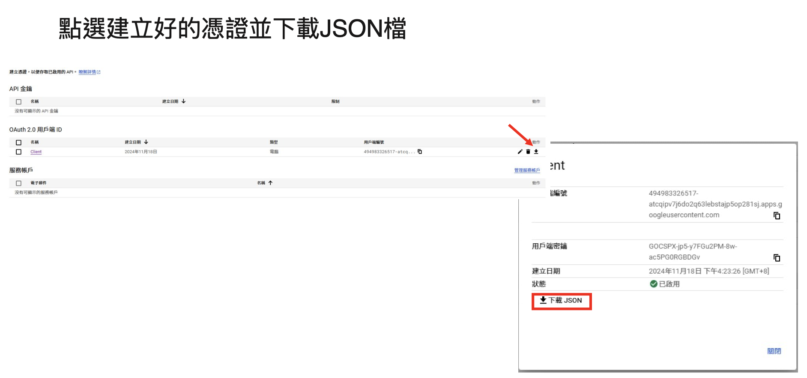
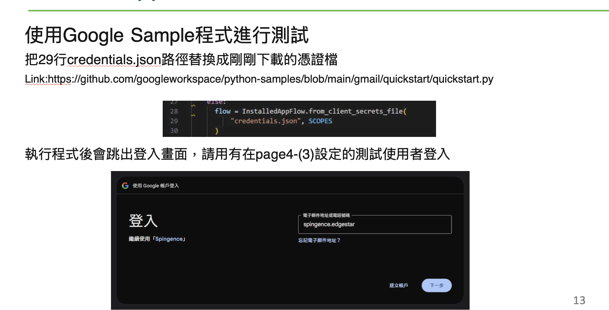
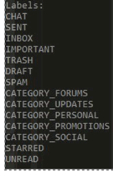

# Gmail Setup

Follow the steps below to setup gmail credentials
[Reference](https://developers.google.com/gmail/api/quickstart/python)

## Step 1: Create a gmail account
## Step 2: Go to [Google Cloud Console](https://console.cloud.google.com/)


## Step 3: Create a new project



## Step 4: Enable Gmail API



## Step 5: Setup OAuth 2.0


## Step 6: Setup credentials



## Step 7: install library
```bash
pip install google-api-python-client google-auth-httplib2 google-auth-oauthlib
```

## Step 8: Login to setup credentials on device
[quickstart.py](./quickstart.py)

Able to access gmail folders
