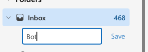

# Microsoft Graph Mail Setup

Follow [Use Postman with the Microsoft Graph API](https://learn.microsoft.com/en-us/graph/use-postman)

#### Postman Steps:

1. Step 1: Fork Microsoft Graph Postman Collection
2. Step 2: Create an Azure AD application
3. Step 3: Setup environment variables
4. Step 4: Next Steps

In the "Step 2: Create an Azure AD application" session, you will be getting the following tokens:

- ClientID
- TenantID
- ClientSecret

### EdgeStar Steps:

We will be using the `clientID`, `tenantID`, and `clientSecret`.
We will need to fill the following environment variables:
- `TENANT_ID`
- `CLIENT_ID`
- `SECRET`
- `OFFICE_USER_ID`
- `BOT_MAIL_FOLDER_ID`

#### 1. Setup environment variables from the example file `../../../envs/.env.mail.example`(workflow/envs/.env.mail.example)

```python
TENANT_ID=
CLIENT_ID=
SECRET=
```

#### 2. Get users and select the user you want to use

```bash
python client.py --mode list_users --env_path ../../../envs/.env.mail.example --output_path users.json
```
File `users.json` will be created in the current directory. Choose the user you want to use and update the `OFFICE_USER_ID` in the environment variables file.

```json
[
  {
    "businessPhones": [],
    "displayName": "Test User",
    "givenName": null,
    "jobTitle": null,
    "mail": "test@spingence.com",
    "mobilePhone": null,
    "officeLocation": null,
    "preferredLanguage": null,
    "surname": null,
    "userPrincipalName": "test@spingence.com",
    "id": "OFFICE_USER_ID"
  }
]
```

#### 3. Update the `OFFICE_USER_ID` in the environment variables file

```python
OFFICE_USER_ID=
```

#### 4. Create a new mail folder `Bot`

  - create mail folder
  - name the folder `Bot`
  - create routing rule to the folder
#### Create Mail Folder

#### Name the folder

#### Create Routing Rule


#### 5. Get the Mail Folder ID

```bash
python client.py --mode list_mail_folders --env_path ../../../envs/.env.mail.example --output_path mail_folders.json
```
File `mail_folders.json` will be created in the current directory. Choose the mail folder you want to use and update the `BOT_MAIL_FOLDER_ID` in the environment variables file.

```json
[
  {
    "id": "MAIL_FOLDER_ID",
    "displayName": "Bot",
    "parentFolderId": "PARENT_MAIL_FOLDER_ID",
    "childFolderCount": 0,
    "unreadItemCount": 0,
    "totalItemCount": 0,
    "sizeInBytes": 0,
    "isHidden": false
  }
]
```

#### 6. Update the `BOT_MAIL_FOLDER_ID` in the environment variables file

```.env
BOT_MAIL_FOLDER_ID=MAIL_FOLDER_ID
```

#### 7. Test the connection

```bash
python client.py --mode test_connection --env_path ../../../envs/.env.mail.example
```
